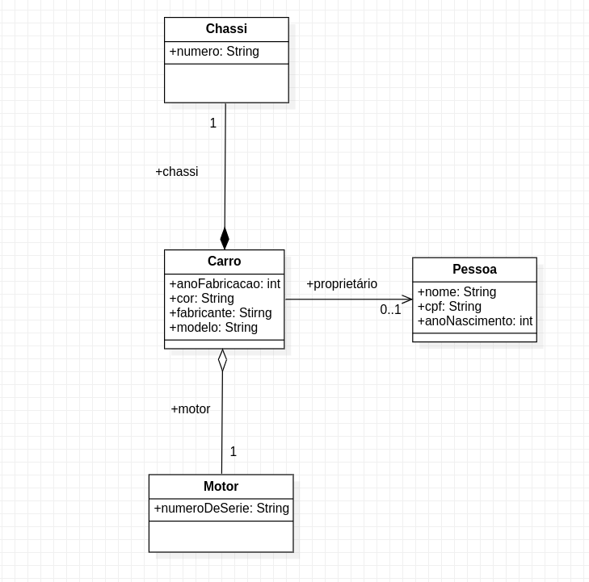

# Estudo e prática com JAVA

Esse repositório foi criado para armazenar projetos baseados na prática, e acompahamento da evolução dos estudos com foco em JAVA, Spring e Angular.

## Aprendizados

Esotu relembrando tópicos abordados na minha graduação como (UML e POO), e aprendendo novas tecnologias como Spring e em breve Angular. 

